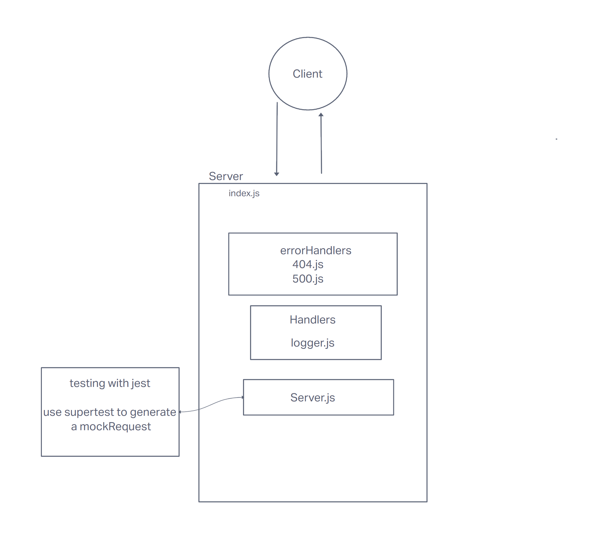

# LAB - Class 01

## Project: server-deployment-practice

### Author: Marcus Bynoe

### Problem Domain

Basic API Server where we write some middleware and practice deployment. Built from scratch.

### Links and Resources

- [GitHub Actions ci/cd](https://github.com/marcusbynoe/server-deployment-practice/actions/runs/4169443959/jobs/7217409366)
- [back-end server url](https://d51-practice-mb.onrender.com)

### Setup

#### `.env` requirements (where applicable)

N/A

#### How to initialize/run your application (where applicable)

- e.g. `npm start`

#### How to use your library (where applicable)

#### Features / Routes

- Feature One: Deploy as dev branch once ci/cd works.

#### Tests

- How do you run tests?
- Any tests of note?
- Describe any tests that you did not complete, skipped, etc

#### UML

